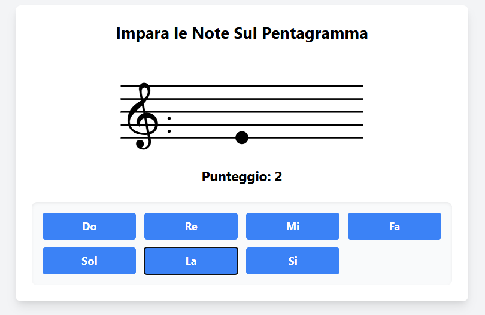
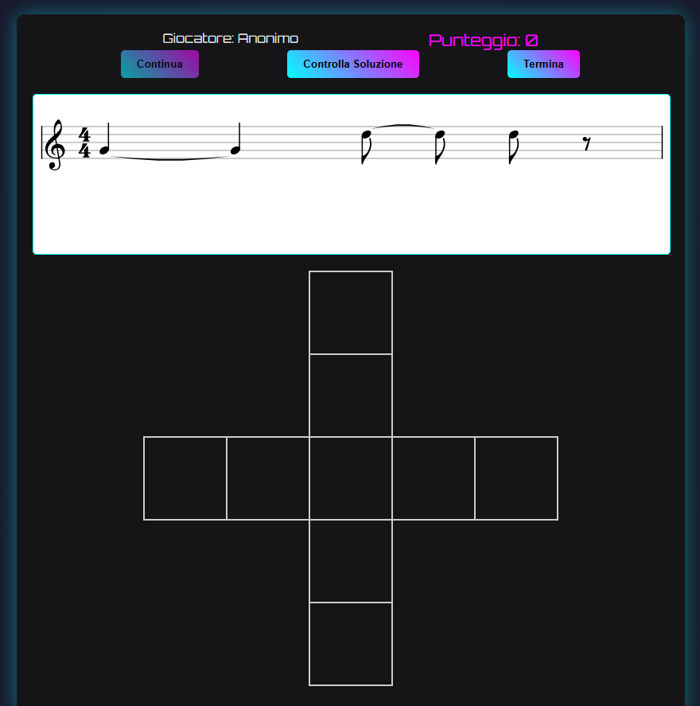

# Music Education Tools

A collection of interactive web tools and educational games designed to support music theory, solfeggio and rhythm training.

These projects were developed for real students and educational contexts, with the goal of transforming basic music-learning exercises into simple, visual and interactive web applications.

## Projects

| Project | Type | Learning Goal | Status | Live Demo |
|---|---|---|---|---|
| Music Notes Trainer | Educational Web Game | Staff reading and note recognition | Deployed | [Open](https://www.accademiamusicalegirolamoscarasciullo.com/NotePentagramma/righespazi.html) |
| Croce Ritmica | Gamified Rhythm Tool | Rhythm recognition and musical timing | Deployed | [Open](https://www.accademiamusicalegirolamoscarasciullo.com/GiocoCroceRitmica/index.html) |

## Screenshots

### Music Notes Trainer

### Croce Ritmica

## Music Notes Trainer

Music Notes Trainer is a lightweight educational web game designed to help beginner music students recognize notes on the staff through immediate visual feedback and score-based repetition.

### Main features

- Interactive note recognition exercise
- Visual staff-based learning
- Immediate feedback
- Score tracking
- Simple interface for beginner students

## Croce Ritmica

Croce Ritmica is a gamified rhythm-learning web application designed to make rhythm recognition more engaging through interaction, scoring and achievement-based feedback.

### Main features

- Rhythm-based educational gameplay
- User interaction flow
- Scoring logic
- Leaderboard-style learning experience
- Certificate generation

## Why this repository exists

This repository collects small educational tools built around real learning needs.

The goal is not only to provide exercises, but to design accessible web applications that make music theory and rhythm practice more interactive for students.

## Portfolio relevance

Although these projects are outside my main focus on control systems, embedded systems and model-based engineering, they demonstrate my ability to:

- design user-facing software tools;
- translate real educational needs into working applications;
- build and deploy lightweight web applications;
- create simple interfaces for non-technical users;
- document practical software projects clearly.

## Next steps

- Add screenshots for each tool
- Add short usage notes
- Improve project structure
- Add technical implementation details
- Consider moving mature tools into standalone repositories
