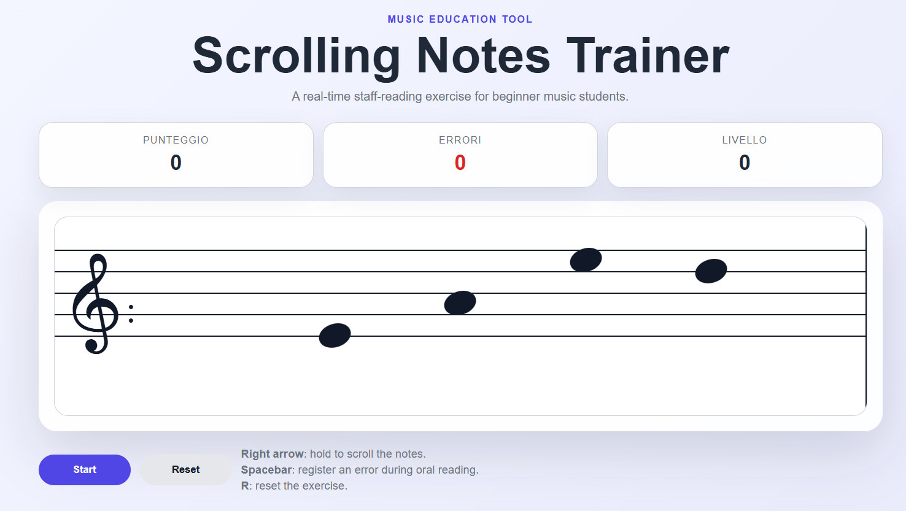

# Music Education Tools

A showcase repository for interactive web tools and educational games designed to support music theory, solfeggio, rhythm training and real-time staff-reading practice.

The projects listed here were developed for real students and educational contexts, with the goal of transforming traditional music-learning exercises into simple, visual and interactive web applications.

This repository acts as an entry point to individual tools, live demos and dedicated project repositories.

---

## Projects

| Project | Type | Learning Goal | Repository | Live Demo | Status |
|---|---|---|---|---|---|
| Music Notes Trainer | Educational Web Game | Staff reading and note recognition | [Repository](https://github.com/mikabba/music-notes-trainer) | [Open](https://www.accademiamusicalegirolamoscarasciullo.com/NotePentagramma/righespazi.html) | Deployed |
| Croce Ritmica | Gamified Rhythm Tool | Rhythm recognition, subdivision and musical timing | [Repository](https://github.com/mikabba/croce-ritmica) | [Open](https://www.accademiamusicalegirolamoscarasciullo.com/GiocoCroceRitmica/index.html) | Deployed |
| Scrolling Notes Trainer | Real-Time Staff Reading Tool | First-sight note-reading fluency and continuous staff reading | [Repository](https://github.com/mikabba/scrolling-notes-trainer) | [Open](https://mikabba.github.io/scrolling-notes-trainer/) | Deployed |

These tools are intentionally focused: each one targets a specific music-learning need through immediate feedback, visual interaction, repetition or real-time practice.

---

## Featured tools

### Music Notes Trainer

  

Music Notes Trainer is an educational web game designed to help beginner music students recognize notes on the staff through visual feedback and score-based repetition.

**Main features**

- Interactive note recognition exercises
- Staff-based visual learning
- Immediate feedback
- Score tracking
- Simple interface for beginner students

**Links**

- [Live demo](https://www.accademiamusicalegirolamoscarasciullo.com/NotePentagramma/righespazi.html)
- [Project repository](https://github.com/mikabba/music-notes-trainer)

---

### Croce Ritmica

  

Croce Ritmica is a gamified rhythm-learning web application designed to make rhythm recognition and rhythmic subdivision more engaging through interaction, scoring, leaderboard progression and achievement-based feedback.

**Main features**

- Rhythm-based educational gameplay
- Random rhythm generation
- Interactive cross-shaped answer grid
- Automatic solution checking
- Scoring logic
- Leaderboard-style learning experience
- Certificate-based achievement feedback

**Links**

- [Live demo](https://www.accademiamusicalegirolamoscarasciullo.com/GiocoCroceRitmica/index.html)
- [Project repository](https://github.com/mikabba/croce-ritmica)

---

### Scrolling Notes Trainer

  

Scrolling Notes Trainer is a lightweight real-time staff-reading tool designed to improve first-sight note-reading fluency through continuous scrolling, score progression and manual error tracking.

**Main features**

- Random note generation on a scrolling staff
- Continuous real-time reading exercise
- Score progression during the activity
- Speed increase based on score
- Manual error tracking with keyboard input
- Level progression with visual background changes
- Lightweight static web implementation

**Links**

- [Live demo](https://mikabba.github.io/scrolling-notes-trainer/)
- [Project repository](https://github.com/mikabba/scrolling-notes-trainer)

---

## Why this repository exists

This repository collects educational web tools built around real learning needs.

The goal is to document small but complete applications that make music theory, solfeggio, rhythm practice and first-sight note reading more interactive, accessible and engaging for students.

---

## Portfolio relevance

These projects complement my main engineering portfolio by demonstrating my ability to:

- translate real educational needs into working software tools;
- design simple interfaces for non-technical users;
- build and deploy user-facing web applications;
- implement interaction logic, scoring systems and feedback mechanisms;
- create real-time browser-based learning exercises;
- organize small applications into documented, reusable project repositories.

---

## Repository role

This repository serves as the central index for my music education tools.

Each mature tool is documented here and maintained in its own dedicated repository with source code, screenshots, usage notes and implementation details.
